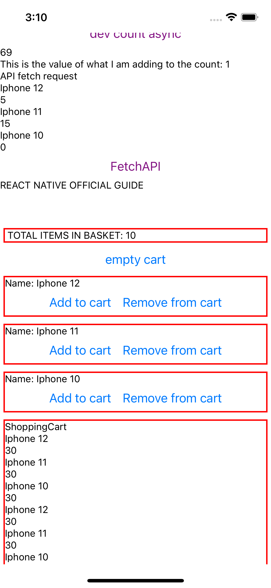

# Redux, React Native, Redux Saga Shopping Cart demo


The below is a worked example for learning how to use react-redux in react native with redux saga. The attached doccuments fetch from a locally running HTTP server.
Please access the server read me to run the project.



## To run server

```
cd backend
npm run serverDev
```

## To run app

```
npm install (first time)
npx react-native start
npx react-native run-ios
```
